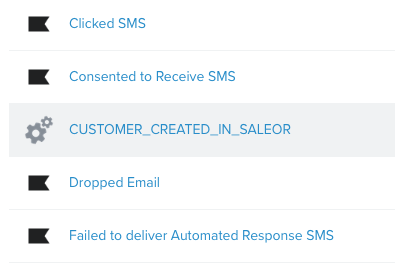
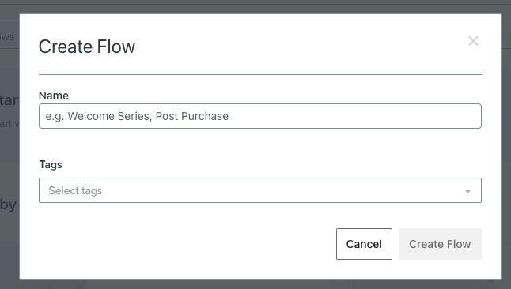
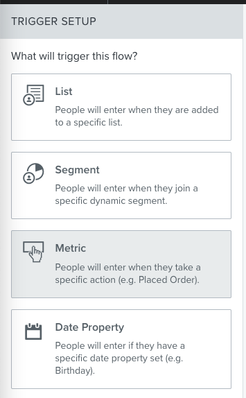
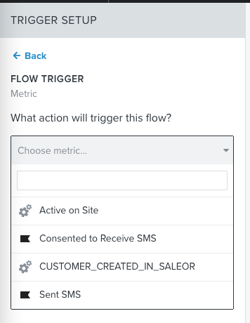
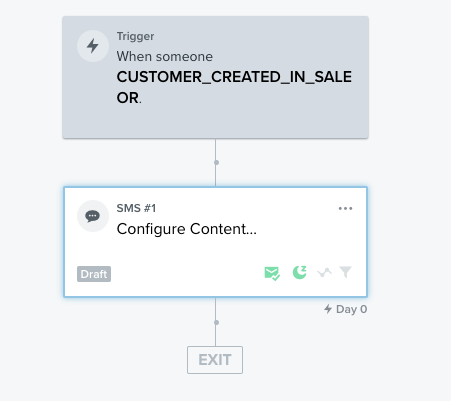

# These are basic steps to connect App with your Klavio app

## Install app

Follow [readme](../README.md) and deploy app. Then, install it in your Saleor Dashobard

## Create Klaviyo account

Naturally you need Klaviyo access - you can sign up [here](https://www.klaviyo.com/)

## Get your public key

Follow this [Klaviyo document](https://help.klaviyo.com/hc/en-us/articles/115005062267-How-to-Manage-Your-Account-s-API-Keys), to find your public key

## Configure app in Dashboard

1. Open Dashboard and navigate to Apps section
2. Find your fresh installed Klaviyo app
3. Paste public key into the input field and save

## Trigger initial webhook

Klaviyo needs first, initial API call to be performed, which will create a metric (name can be configured in Klaviyo App configuration screen)

Let's navigate to Customers and create first, dummy customer

Then, open Klavio [Metrics page](https://www.klaviyo.com/analytics/metrics)

Your Metric should be visible on the list

## Create flow

Now, you can create your first flow

1. Open [flow creation page](https://www.klaviyo.com/flows/create)
2. Click "Create from scratch" and name your flow
   
3. Create new trigger with "Metric"
4. Your freshly sent Metric should be available!
5. Now you can proceed creating your flow. Feel free to welcome your user!
